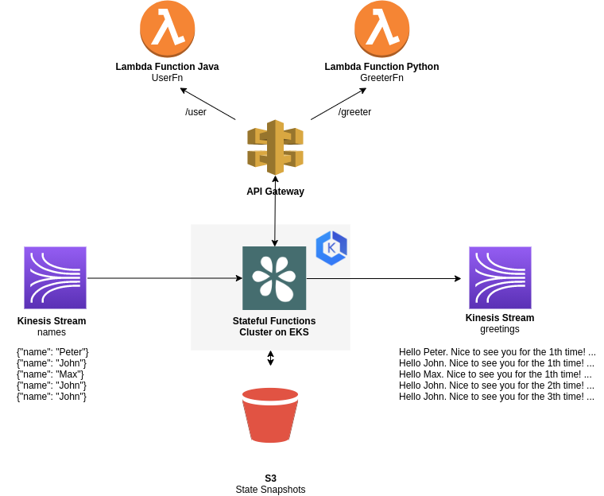

# Serverless meets Apache Flink Stateful Functions on AWS

[Stateful Functions](statefun.io) is a project under the umbrella of [Apache Flink](flink.apache.org). 
It makes it simple to build consistent, stateful applications at any scale.

This repository demonstrates how Stateful Functions complements FaaS: 

* Stateful Functions makes it easy to compose larger applications out of individual functions. 
  In this demo there are two functions: `UserFn` (implemented in Java) and `GreeterFn` (implemented in Python). 
* Stateful Functions provides consistent fault-tolerant state and exactly-once messaging between functions. 
  As a developer you don't need to worry about retries, network failures, etc.  


<p align="center">
  
</p>

## Structure

* [user-handler](user-handler) contains the implementation of the `UserFn` Lambda. This function is implemented in Java 11. The artifact is a JAR.
* [greeter-handler](greeter-handler) contains the implementation of the `GreeterFn` Lambda. This is function is implemented in Python. The artifact is Docker image.
* [generator](/generator) contains the a small data generator that is deployed into the same Kubernetes cluster as Stateful Functions.
* [k8s](/k8s) contains the Kubernetes manifests of the data generator and the Stateful Functions cluster. This also contains the [module.yaml](/k8s/statefun/resources/greeter-module.yaml.template).
* [terraform-function-repositories](/terraform-function-repositories) contains the terraform manifests for ECR and and an S3 Bucket to host the `UserFn` JAR. 
* [terraform-statefun](/terraform-statefun) contains the terraform manifests for everything else (EKS, Gateway, Lambda Functions).

## Trying it out yourself

### Prerequisites

* an AWS account
* `terraform`
* `aws`
* `kubectl`  
* `mvn`
* `docker`  
* `envsubst`

### Setup 

**Step 1**

Change the terraform backend to a pre-created bucket in [main.tf](terraform-function-repositories/main.tf) and [main.tf](terraform-statefun/main.tf).
Then, SET the variables in the [Makefile](Makefile) to fit your environment (all except `GATEWAY_ID`)

``
make terraform-statefun
``

**Step 2**

Now, update the `GATEWAY_ID` variable in the [Makefile](Makefile)  to the value returned by `make terraform-statefun`.

```
make k8s
```

## Trailing the Output

The date generator not only generates names to the `names` stream, but also reads the `greetings` stream and prints those records to STDOUT.
So, you can use the following command to trail the greetings stream.

```
kubectl logs -n generator greeter-generator-<id>  -f 
```
## Accessing the Flink UI

A Stateful Functions cluster boils down to a Flink Cluster running a specific Flink job. 
You can forward a local port to the Flink UI via the following command.  

```
kubectl port-forward -n statefun services/statefun-master 8081
```